Passionate about programming and learning.

## Open Source Libs

## Learnin' Rust
| | | |
:-------------------------:|:-------------------------:|:-------------------------:
  |    |   

## Simulation Gifs

| | | |
:-------------------------:|:-------------------------:|:-------------------------:
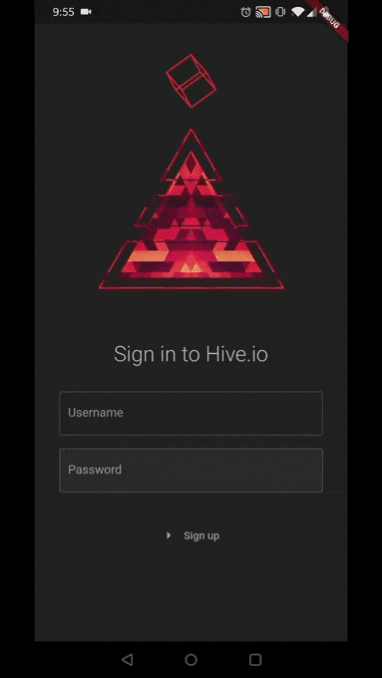  |    |   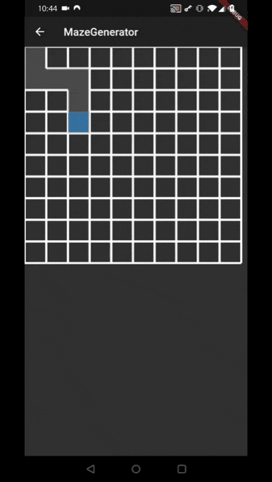
  |  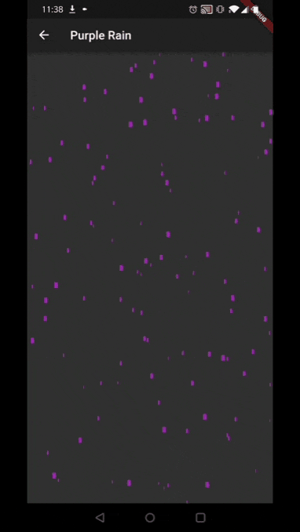  |   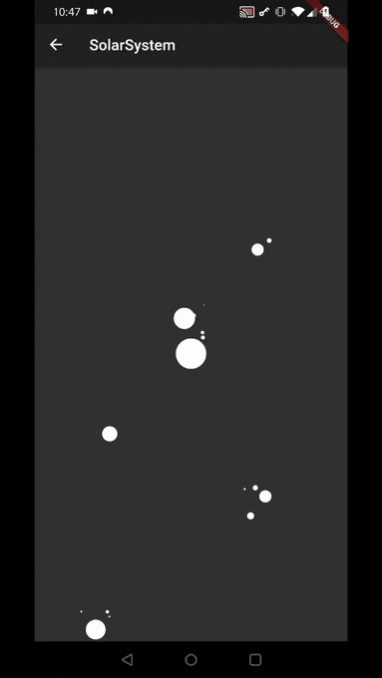

## Dribbble Recreations

| | | |
:-------------------------:|:-------------------------:|:-------------------------:
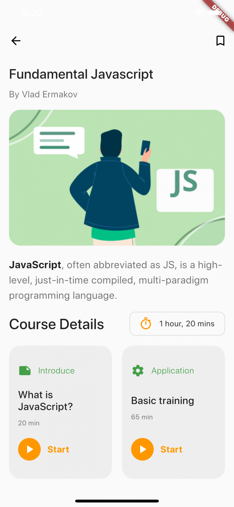  |  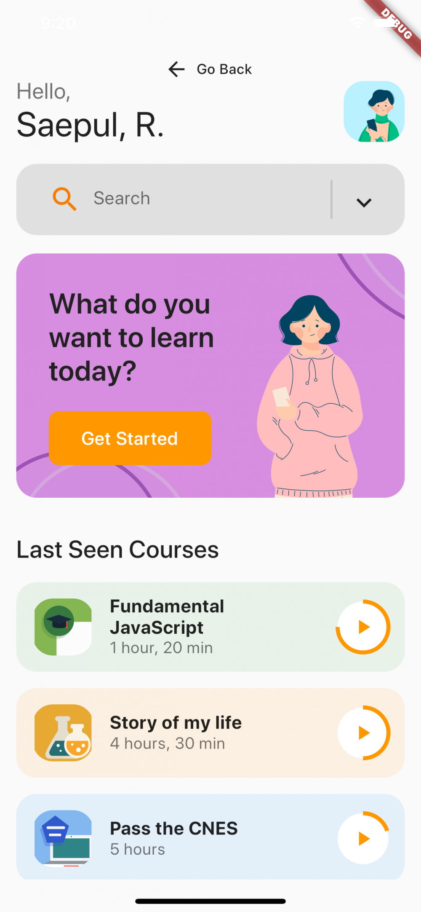  |   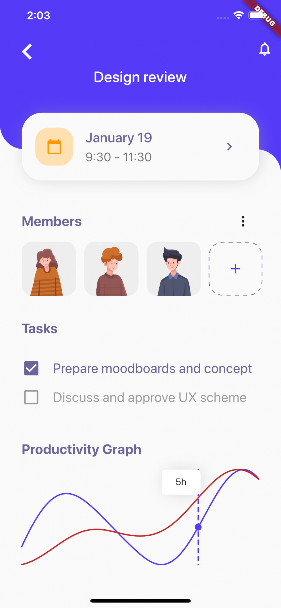
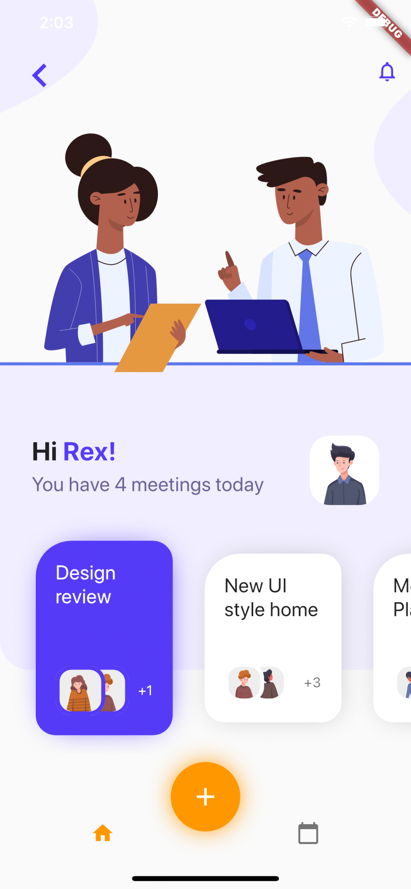  |  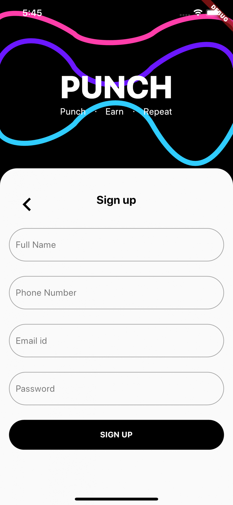  |   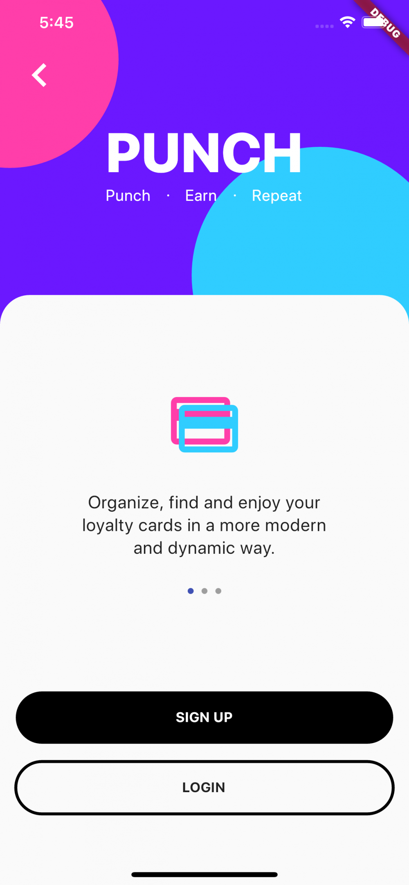
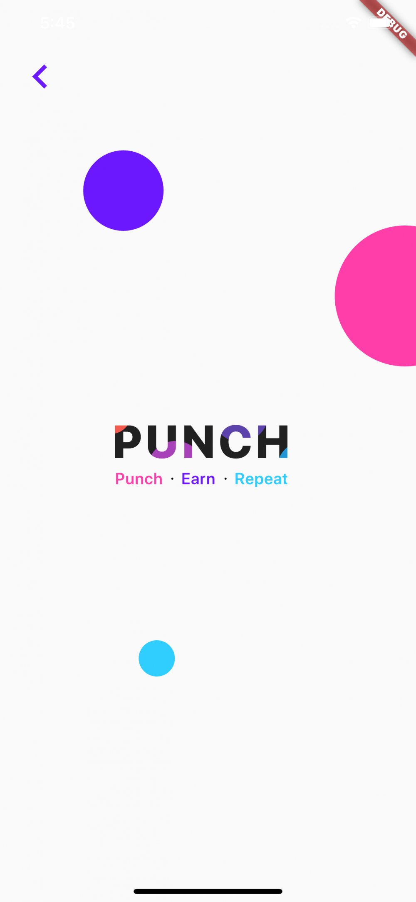  |   |  

