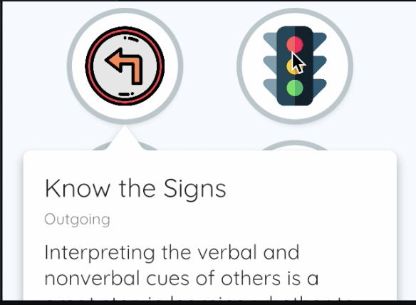
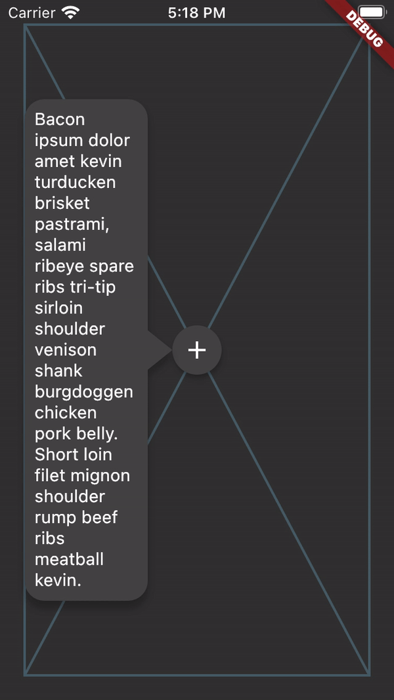
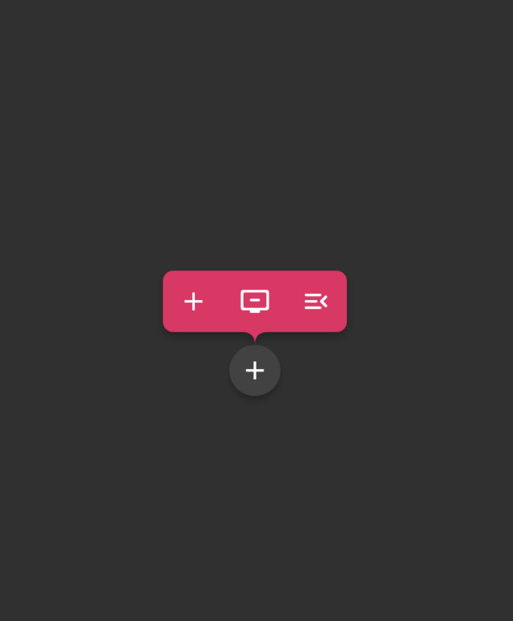
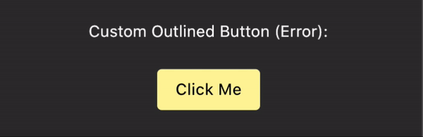
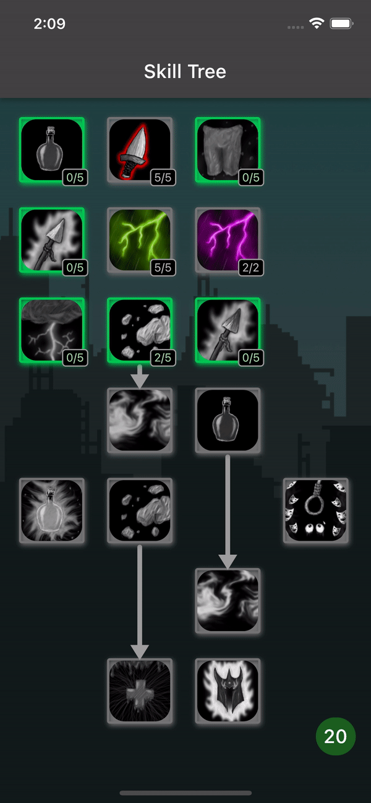
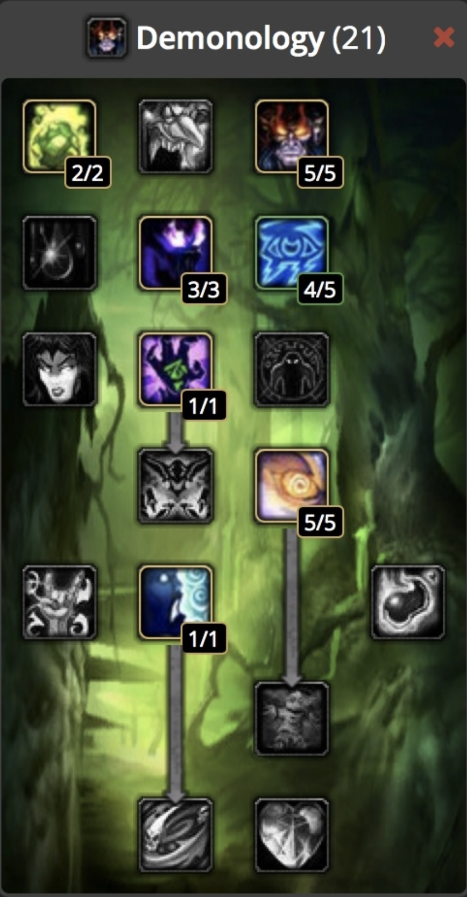
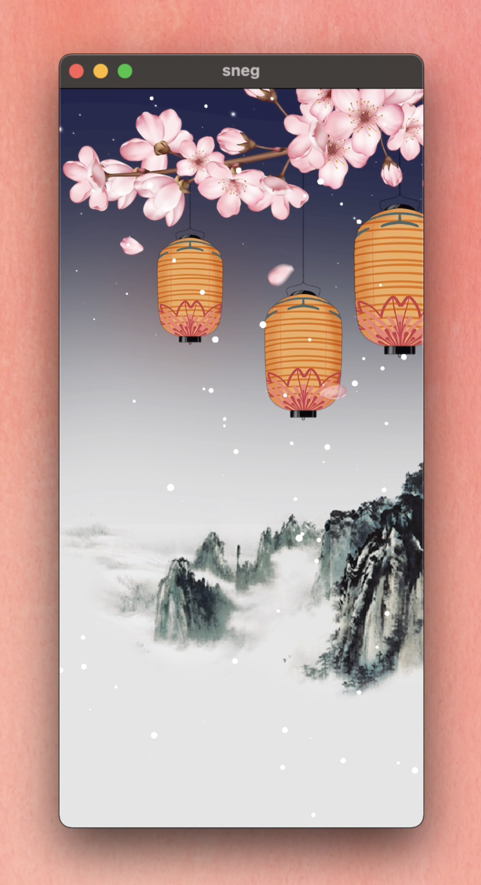
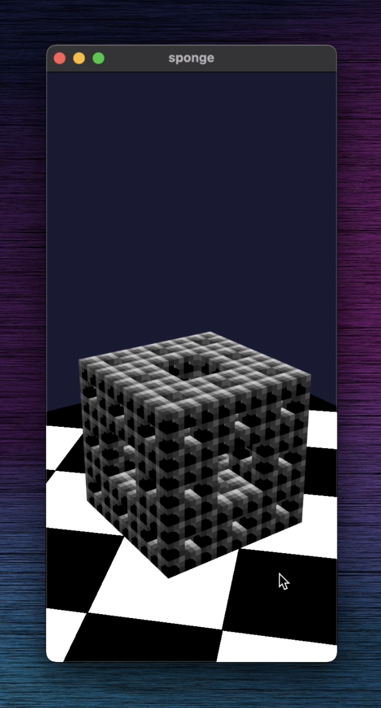
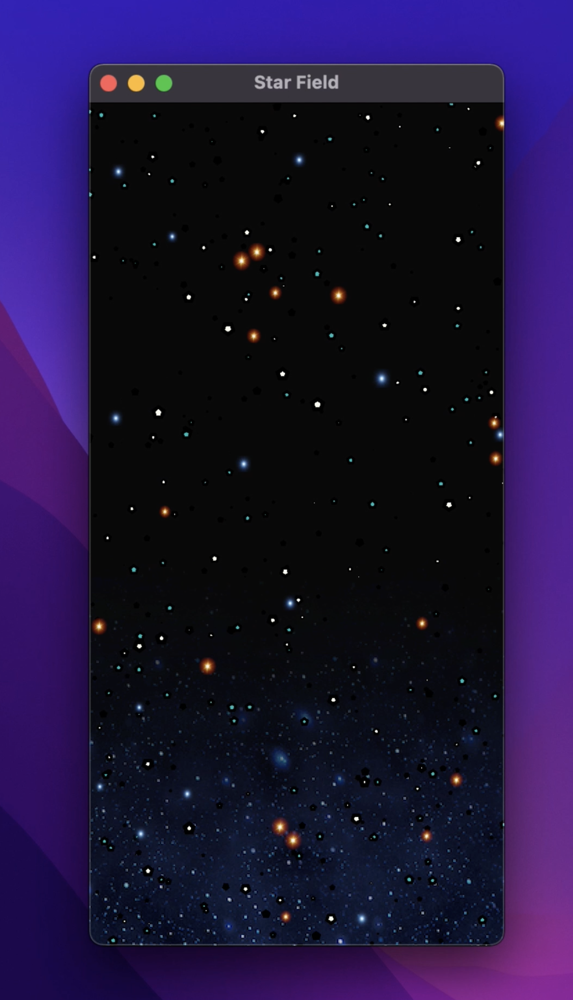

# Rex 🦕

Passionate about programming, learning new things and staying indoors.

# Open Source Libs

## [just_the_tooltip](https://pub.dev/packages/just_the_tooltip)

| | | |
:-------------------------:|:-------------------------:|:-------------------------:
  |    |   

## [async_button_builder](https://pub.dev/packages/async_button_builder)
 

| | | |
:-------------------------:|:-------------------------:|:-------------------------:
  |    |   

## [skill_tree](https://pub.dev/packages/skill_tree)

| Skill tree package | WoW classic tree |
:-------------------------:|:-------------------------:
  |   

## [Learnin' Rust Videos 🎥](./videos.md)

| | | |
:-------------------------:|:-------------------------:|:-------------------------:
  |    |   

# Current Interests

* [Rust](https://github.com/rust-lang/rust)
* [Flutter/Dart](https://github.com/flutter/flutter)
* [Node/visual programming](https://github.com/enso-org/enso)
* [Containers](https://github.com/docker)
* [Games programming and shader art](https://github.com/bevyengine/bevy)
* [NLP with Hugging Face 🤗](https://huggingface.co/)

# Simulation Gifs 👾

| | | |
:-------------------------:|:-------------------------:|:-------------------------:
  |    |   
  |    |   

# Dribbble Recreations
\*Designs are not mine. Credit goes to respective designers.\*

| | | |
:-------------------------:|:-------------------------:|:-------------------------:
  |    |   
  |    |   
  |   |  

