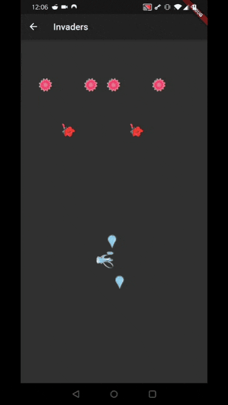

Passionate about programming and learning.

## Open Source Libs

## [just_the_tooltip](https://pub.dev/packages/just_the_tooltip)

## [async_button_builder](https://pub.dev/packages/async_button_builder)
 

## Learnin' Rust

| | |
:-------------------------:|:-------------------------:
https://user-images.githubusercontent.com/29642168/146605381-ef3cf259-ef51-483b-bac7-6a52a001cd78.mp4  |  https://user-images.githubusercontent.com/29642168/146605567-a52d1dd9-ab06-434f-808e-3381c3943fe6.mp4
https://user-images.githubusercontent.com/29642168/146605752-6524355f-e898-4ed9-880c-fdbb034068bf.mp4  | 

## Simulation Gifs

| | | |
:-------------------------:|:-------------------------:|:-------------------------:
  |    |   
  |    |   

## Dribbble Recreations

| | | |
:-------------------------:|:-------------------------:|:-------------------------:
  |    |   
  |    |   
  |   |  

